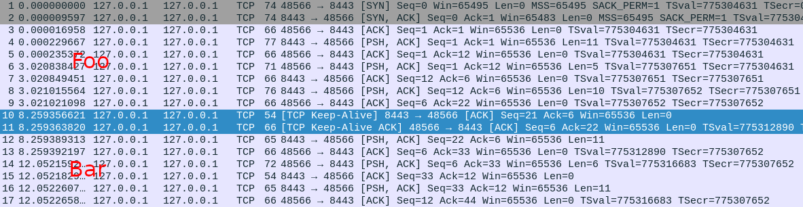

# tcp_repair

**Note**: Linux added support for TCP_REPAIR in setsockopt with kernel version 3.5+ to facilitate live migration of active connections.



```sh
$ go run foo.go
listen 127.0.0.1:8443
connected
save socket.dat
exit status 1
$ go run bar.go socket.dat
connected
```

```sh
$ nc -v 127.0.0.1 8443
Connection to 127.0.0.1 8443 port [tcp/*] succeeded!
foo> hello
quit
foo> quit
bar> hello
world
bar> world
```

## Potential Use Cases:

* **Process Checkpoint/Restore**: Seamlessly save and restore network connections using tools like [CRIU](https://criu.org/TCP_connection).

* **Graceful Restarts**: Maintain active connections during application restarts without disruption.

* **Direct Server Return (L7-DSR) / SYN Proxy**: Transfer established connections (e.g., post-SSL handshake) from a load balancer to a backend server, ensuring smooth traffic management and migration.

## References
* https://lwn.net/Articles/495304/
